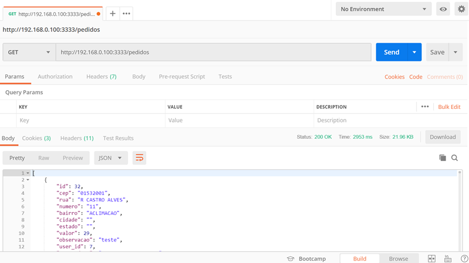
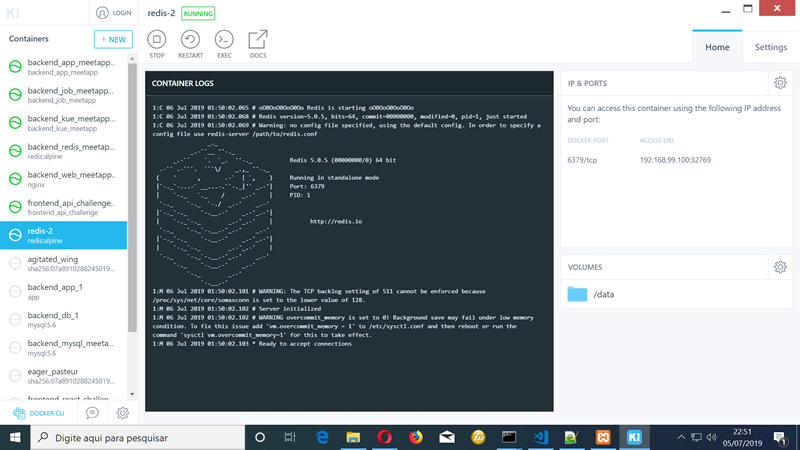
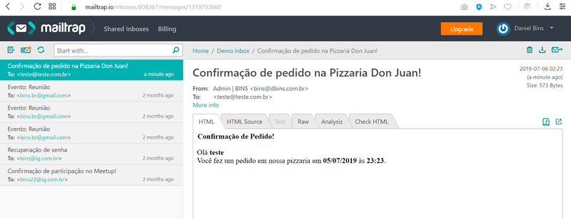

# DESAFIO FINAL 2 - Backend Pizzaria

Este é o backend feito em AdonisJS com banco de dados MySQL. Este backend faz parte do desafio final do Bootcamp da Rocketseat. Este backend será consumido por uma aplicativo feito em React Native e por um site feito em React JS.

Nesse desafio foi construída uma aplicação completa envolvendo back-end com NodeJS, front-end com ReactJS e mobile com React Native.

A aplicação consiste em um app de controle de pedidos por delivery de uma pizzaria. O aplicativo móvel será utilizado pelos clientes da pizzaria para realizar pedidos e a versão web será utilizada para controle e registro dos pedidos realizados.

A aplicação chamada “Pizza Don Juan” será utilizada para realizar e controlar pedidos de delivery. A aplicação não suportará mais restaurantes sendo feita apenas para essa pizzaria.

O aplicativo pode ser visto neste link:

https://github.com/dbins/rocketseat_desafiofinal2_mobile

O frontend pode ser visto neste link:

https://github.com/dbins/rocketseat_desafiofinal2_frontend



## Requisitos Funcionais

**Usuário/Autenticação**

- Deve ser possível o usuário se autenticar e criar sua conta na aplicação;
- O usuário pode ser administrador ou cliente, você pode adicionar uma  coluna com o tipo de usuário na tabela de usuários;
- Quando um usuário se cadastra ele é automaticamente um cliente;
- Não deve ter cadastro de usuário admnistradores, crie um usuário administrador manualmente para utilizar a versão web do sistema;

**Cardápio**

- O cardápio deve ser cadastrado através de API, você deve ter tabelas para armazenar produtos (pizza/bebidas/massas), tipo de produtos (sabor de pizza/marca de refrigerante) e tamanho do produto (cm para pizzas/ml para bebidas/P,M ou G para outros);
- Não existirá uma interface para cadastro dessas informações, mas você pode cadastrá-las usando o próprio Insomnia ou o Postman.
- O relacionamento ficará da seguinte forma: 1 produto tem N tipos - 1 tipo tem N tamanhos
- O relacionamento entre tipo e tamanho define o valor do produto, ou seja, uma pizza média de 4 queijos pode custar diferente de uma pizza média de calabresa.

## Instalação

- git clone https://github.com/dbins/rocketseat_desafiofinal2_backend
- npm install
- Criar o banco de dados vazio no MySQL (nome: pizzaria)
- Alterar as configurações de conexão com o banco de dados no arquivo .env localizado na raiz do projeto
- Rodar a migration: adonis migration:run
- Rodar a carga inicia de dados (seed): adonis seed
- Para ativar o servidor: adonis serve --dev
- O servidor vai subir no endereço http://127.0.0.1:3333. Isso pode ser alterado no arquivo .env localizado na raiz do projeto. (variáveis HOST e PORT)

## Redis

- No Windows 10, foi utilizado o Kitematic (Alpha) para gerenciar os containers
- Baixar o container Redis
- Iniciar o container Redis
- Editar o arquivo config/redis.js. No objeto local, colocar dados de conexão
- No arquivo .env localizado na raiz do projeto, configurar o REDIS_HOST e o REDIS_CONNECTION
- No arquivo .env, localizado na raiz do projeto, colocar as credenciais de email MAIL_HOST - MAIL_PORT - MAIL_USER - MAIL_PASS
- Depois de iniciar o servidor, numa janela de terminal em separado, dentro da pasta do projeto, executar:
  adonis kue:listen

  
  

## Rotas da aplicação

Para ver as rotas e o formato das requisições, consulte a documentação disponível no arquivo index.html localizado na raiz do projeto. Esta documentação foi criada usando a API Blueprint, o arquivo com a documentação se chama api.md e fica na raiz do projeto.

Um resumo das rotas pode ser visto abaixo:

| Rota                                 | Método | Descrição                                      |
| ------------------------------------ | ------ | ---------------------------------------------- |
| /register                            | POST   | Criar usuário                                  |
| /sessions                            | POST   | Login do usuário - gerar Token                 |
| /sessions_social                     | POST   | Login do usuário por rede social- gerar Token  |
| /files                               | POST   | Salvar Imagem do produto                       |
| /files/:id                           | GET    | Recuperar Imagem                               |
| /files/:id                           | PUT    | Atualizar Imagem                               |
| /files/:id                           | DELETE | Excluir Imagem                                 |
| /produtos                            | GET    | Categoria de Produtos                          |
| /produtos                            | POST   | Cadastro de Categoria de Produto               |
| /produtos/:id                        | PUT    | Atualizar Produto                              |
| /produtos/:id/tipos                  | GET    | Listar tipo de produtos                        |
| /produtos/:id/tipos                  | POST   | Cadastrar tipo de produtos                     |
| /produtos/:id/tipos/:id              | PUT    | Atualizar tipo de produto                      |
| /produtos/:id/tipos/:id              | DELETE | Excluir tipo de produto                        |
| /produtos/:id/tipos/:id/tamanhos     | GET    | Listar tamanho de produtos por tipo            |
| /produtos/:id/tipos/:id/tamanhos     | POST   | Cadastar tamanho de produtos por tipo          |
| /produtos/:id/tipos/:id/tamanhos/:id | PUT    | Atualizar tamanho                              |
| /produtos/:id/tipos/:id/tamanhos/:id | DELETE | Excluir tamanho                                |
| /pedidos                             | GET    | Listar todos os Pedidos                        |
| /pedidos/:id                         | GET    | Listar o pedido informado                      |
| /pedidos/:id                         | PUT    | Atualizar pedido (endereço e observação)       |
| /pedidos/app/user                    | GET    | Listar Pedidos do usuário logado no aplicativo |
| /pedidos/dashboard                   | GET    | Indicadores do sistema                         |
| /busca							   | POST   | Localizar produtos por tipo          |

Obs: Existem imagens de exemplo dos produtos na pasta resources/imagens. Na raiz do projeto existe um arquivo chamado Insomnia_2019-07-07.json com as rotas do projeto para serem testadas através do programa Insomnia.

## Comandos utilizados para criar o projeto

```
adonis new backend
adonis make:model User -m -c
adonis make:model Token -m -c
adonis make:model Session -m -c
adonis make:model File -m -c
adonis make:model Produto -m -c
adonis make:model Tipo -m -c
adonis make:model Tamanho -m -c
adonis make:model Pedido -m -c
adonis make:controller Session
adonis make:migration pedido_itens

adonis make:migration login
adonis make:migration log_produto

adonis make:seed User
adonis make:seed File
adonis make:seed Produto
adonis make:seed Tipo
adonis make:seed Tamanho

adonis install @adonisjs/mail
adonis install @adonisjs/redis
adonis install @adonisjs/drive
adonis install @adonisjs/http-logger
adonis install @adonisjs/validator
adonis install @adonisjs/antl
npm install moment
npm install mysql --save
npm install --save adonis-kue
adonis make:ehandler
adonis make:job PizzariaEmail
(Obs: Configurar config/auth e definir JWT como padrão)

npm install youch
adonis make:validator Login
adonis make:validator User
adonis make:validator Produto
adonis make:validator Tamanho
adonis make:validator Tipo
adonis make:validator Pedido

//Criar banco de dados vazio no MySQL - pizzaria

//Para criar as tabelas do banco de dados depois de configurar as migrations
adonis migration:run

//Para fazer a carga inicial de dados
adonis seed

//Para executar a API
adonis serve --dev

//Para conferir as rotas disponiveis
adonis route:list 
```

## Instalação ESLINT - Prettier

npm install -D eslint
npx eslint --init

npm install --save-dev prettier
npm install --save-dev eslint-plugin-prettier
npm install --save-dev eslint-config-prettier

## Testes unitários

Existem testes unitários feitos com a ferramenta Dredd
